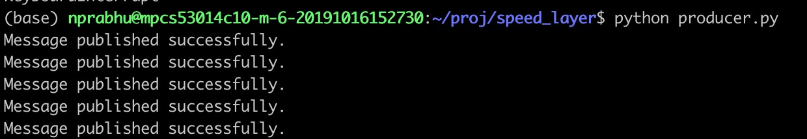
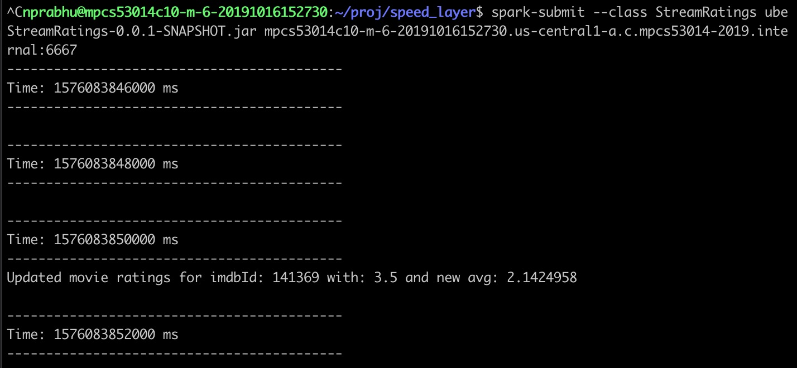

# big-data-movie-ratings

This Hadoop-based web app allows users to view movie ratings for any given movie and generate movie rankings.

There are two webpages in the app:

1. "/movie_ratings" to the view movie rating breakdown for any movie:

Ratings demo

2. "/movie_rankings" to display best or worst movies by genre:

Rankings demo

The app is modeled after the [lambda architecture](https://en.wikipedia.org/wiki/Lambda_architecture) and consists of a batch layer (HDFS/Hive), serving layer (HBase), and streaming layer (Spark and Kafka).

- [Background](#background)
- [Data](#data)
- [Batch and serving layers](#batch%20and%20serving%20layers)
- [Web app](#web%20app)
- [Speed layer](#speed%20layer)

## Background

This is a capstone project from the University of Chicago's "Big Data Application Architecture" MPCS course, taught by Professor [Michael Spertus](https://masters.cs.uchicago.edu/page/michael-spertus). The focus of the couse is how to architect large scale Big Data applications within the Hadoop ecosystem. Although the size of my dataset is on the order of gigabytes, the design is easily extensible to much larger datasets e.g. on the order of petabytes.

The Hadoop cluster and Web servers were all hosted on Google Cloud and managed internally by the UChicago teaching staff.

## Data

The data is sourced primarily from the MovieLens database. One portion of the data comes from their website, https://grouplens.org/datasets/movielens/, and the other from a kaggle competition https://www.kaggle.com/rounakbanik/the-movies-dataset. Together the data is 1.7 GB in size. The csvs
I used from these datasets were:

- movies.csv
- movies_metadata.csv
- ratings.csv
- links.csv

I did some pre-parsing on the data using Pandas. You can find my code in [data_parsing.py](./data_parsing.py). In particular, I created a "movie_genres.csv", sourced from "movies.csv", which uses a
[one hot encoding](https://hackernoon.com/what-is-one-hot-encoding-why-and-when-do-you-have-to-use-it-e3c6186d008f) for the genre-types on each movie. i.e. there is now a boolean column for each genre (e.g. comedy, action, animation) for every movie-row in the table. Note that
a movie can belong to multiple genres.

In addition, I split the "ratings.csv" data into two partitions. One before 1/1/2018 ("ratings_batch_input.csv")
and the other post 1/1/2018 ("ratings_stream.csv"). The former populates the batch layer while the latter will be run as part of the speed-layer.

For brevity, the raw datasets are not included in the repo. Though if downloaded from the listed sources, one could easily rerun the attached scripts to generate the data.

## Batch and serving layers

One can find all my hql scripts in the [hql](./hql) folder. My strategy for creating hive tables
was to first upload the csvs in their raw form as external-csv tables, and then
to map each to an orc-equivalent table. The hql files and corresponding hive/hbase tables are:

- [./hql/movies_metadata.hql](./hql/movies_metadata.hql)
  - nprabhu_movies_metadata_csv
  - nprabhu_movies_metadata
- [./hql/movie_genres_hive.hql](./hql/movie_genres_hive.hql)
  - nprabhu_movie_genres_csv
  - nprabhu_movie_genres_hive
- [./hql/movie_ratings.hql](./hql/movie_ratings.hql)
  - nprabhu_movie_ratings_csv
  - nprabhu_movie_ratings
- [./hql/links.hql](./hql/links.hql)
  - nprabhu_movie_links_csv
  - nprabhu_movie_links_hive
  - nprabhu_movie_links_hbase

Next I created some derived tables based on the above tables. Some are pure hive tables,
some are pure hbase, and some create both hive and hbase. I encourage looking at each hql
file and/or using "describe" on each table in the hive shell to learn more about them.
The hql files and corresponding tables are:

- [./hql/join_movies_table.hql](./hql/join_movies_table.hql)
  - nprabhu_movies (hive)
- [./hql/movie_titles_to_ids.hql](./hql/movie_titles_to_ids.hql)
  - nprabhu_movie_titles_to_ids (hbase)
- [./hql/movie_ratings_count.hql](./hql/movie_ratings_count.hql)
  - nprabhu_movie_ratings_count_hive
  - nprabhu_movie_ratings_count_hbase
- [./hql/movie_ratings_average.hql](./hql/movie_ratings_average.hql)
  - nprabhu_movie_ratings_average_hive
  - nprabhu_movie_ratings_average_secondary_index (hbase)
- [./hql/movie_genres_hbase.hql](./hql/movie_genres_hbase.hql)
  - nprabhu_movie_genres_hbase
- [./hql/movie_ratings_average_by_genre.hql](./hql/movie_ratings_average_by_genre.hql)
  - nprabhu_movie_ratings_average_by_genre_hbase

## Web app

All web app code is found in the [movie_app](./movie_app) directory. It's a simple Node/Express app that uses mustache templating. The most interesting web-app code is found in [./movie_app/app.js](./movie_app/app.js) where I render each web-page and query the serving layer for the requested data.

## Speed layer

The speed layer (found in the [speed-layer](./speed-layer) directory) allows the app to ingest real-time updates to the movie ratings data, and then update the hbase tables for immediate use of the new data. This layer consists of two parts; the producer and consumer of a kafka queue.

The producer is generated by [./speed-layer/producer.py](./speed-layer/producer.py); this simple python script reads in a data file "ratings_stream.csv", and acts as a producer that pipes in the raw data into the "nprabhu_movie_ratings" kafka queue. It inserts a record into the queue every 5 sec. Note that the stream csv is not included in the repo for brevity (see [Data](#data) for how it is generated).

The consumer is generated by the [StreamRating](./speed-layer/StreamRatings) scala project. Within the src/main/scala directory, we find two files: [StreamRatings.scala](./speed-layer/StreamRatings/src/main/scala/StreamRatings.scala) and [RatingRecord.scala](./speed-layer/StreamRatings/src/main/scala/RatingRecord.scala). The latter is a class representation of a row from "ratings_stream.csv" and input into the kafka queue. The former has all logic for consuming the records.

The main method in StreamRatings.scala mapped onto the record is "incrementRatings". Here we do the following:

1. map the record's MovieId to an ImdbId (primary key in most hbase tables)
2. Increment the appropriate rating in "movieRatingsCount" for this ImdbId
3. Computes a new average rating for the movie
4. Updates the "nprabhu_movie_ratings_average_by_genre_hbase" table with this newest avg rating,
   so all rankings have the latest result.
   -- to find the old key, we must reference "nprabhu_movie_ratings_average_secondary_index" to find the old average
   -- as well as "nprabhu_movie_genres_hbase" to find all genres associated with the movie.
5. Updates "nprabhu_movie_ratings_average_secondary_index" to store new avg rating,
   so it's retreivable for future streaming updates.

Here are some screenshots of the running producer and consumer programs as evidence to the hbase tables being updated with the streamed data.

Producer demo

Consumer demo

